# ****Telecom Customer Churn Analysis****

## **What is Customer Churn?**

Customer churn is defined as when **customers or subscribers** discontinue doing business with a **firm or service**.

Individualised customer retention is tough because most firms have a large number of customers and can't afford to devote much time to each of them. **The costs would be too great and outweigh the additional revenue**. However, if a corporation could forecast which customers are likely to **leave ahead of time**, it could focus **customer retention efforts** only on these **"high-risk"** clients. The ultimate goal is to expand its coverage area and retain more customers loyalty. The core to succeed in this market lies in the customer itself.
Customer churn is a critical metric because it is much less expensive to retain existing customers than it is to acquire new customers.

---

## **Objectives:**

Finding the **% of Churn Customers** and Customers that keep in touch with the active services.

**Analysing** the data in terms of various features responsible for **Customer Churn**.

In the future, it will be useful to find the most suitable **machine learning model** for accurate classification of churn and non-churn customers.

---

## **Dataset:**

[Telco Customer Churn](https://www.kaggle.com/code/bhartiprasad17/customer-churn-prediction/data)

**The dataset includes information about:**

Customers who left within the last month – the column is called Churn.

Services that each customer has signed up for – phone, multiple lines, internet, online security, online backup, device protection, tech support, and streaming TV and movies.

Customer account information – how long they’ve been a customer, contract, payment method, paperless billing, monthly charges, and total charges.

Demographic info about customers – gender, age range, and if they have partners and dependents.

---

## **Implementation:**

**Libraries Use for Analysis:**

**Python —** VS Code (Jupyter notebook extension) for EDA and visualizations (Pandas, NumPy, Matplotlib, Seaborn)

## **Technologies:**

**Database & Visualization:**

**SQL —** MySQL(Work Bench) scripts for data import, cleaning, and aggregation.

**Power BI —** Power BI Desktop files (.pbix) with three dashboards: Churn, Revenue, Service.

---

## **Some insights via Screenshots of EDA:**

**Dashboards of telecom customer churn data:**

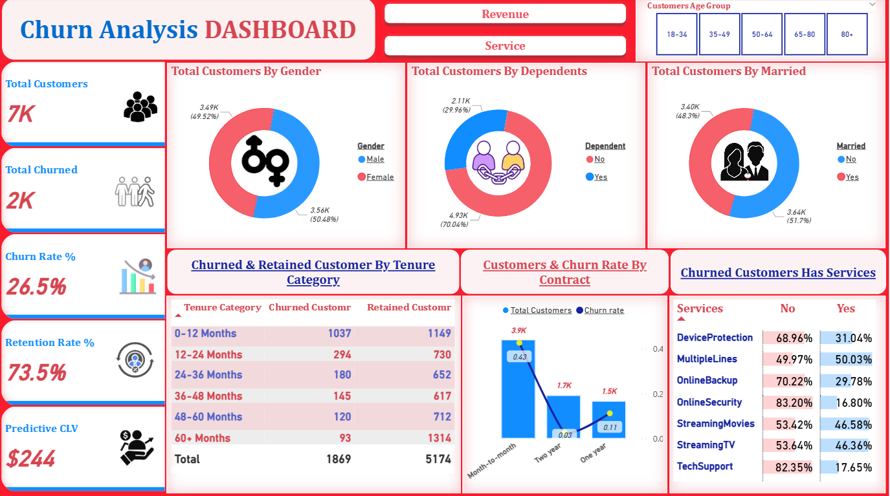

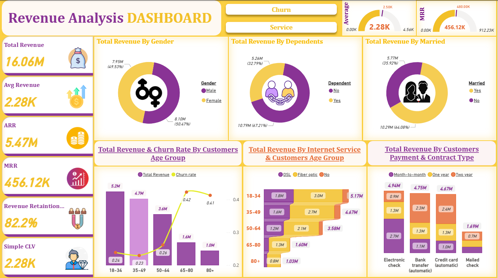

---

**1. Churn Distribution:**

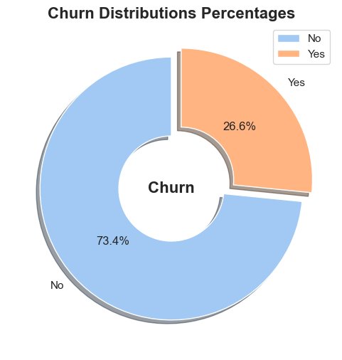

26.6 % of customers switched to another firm.

---

**2. Churn distribution with respect to gender:**

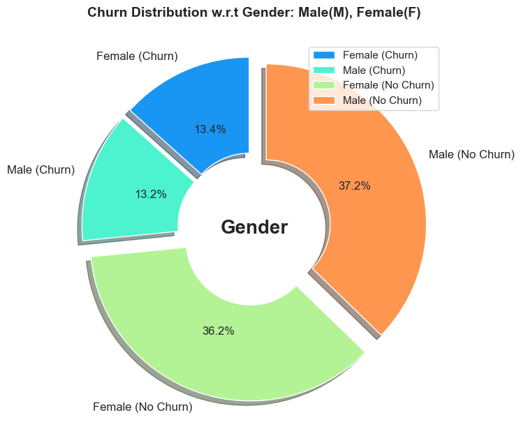

There is negligible difference in customer percentage/count who changed the service provider. Both genders behaved similarly when it comes to migrating to another service provider/firm.

---

**3. Customer Contract distribution vs Churn:**

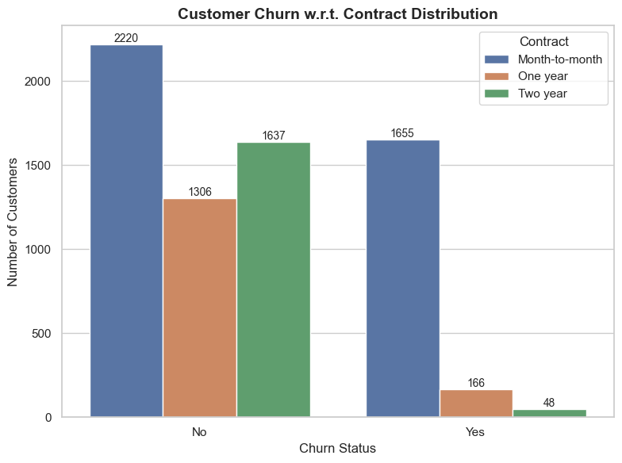

Customer churn was highest among Month-to-Month contract customers who moved out.

---

**4. Payment Methods:**

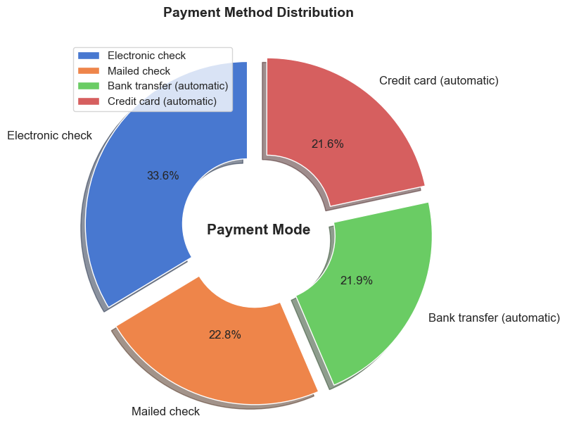

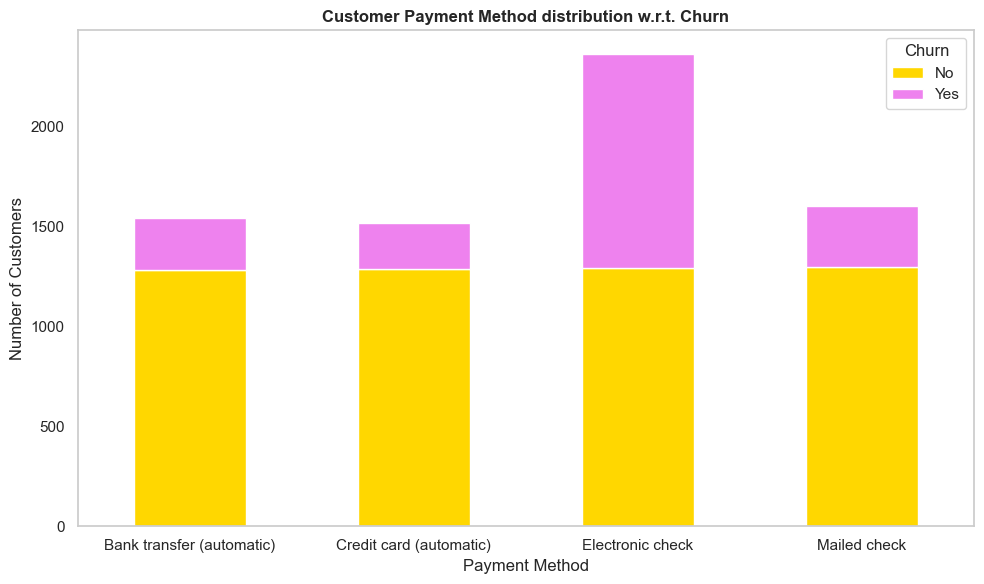

A majority of customers who churned were using Electronic Check as their payment method, while those paying via Credit Card auto-transfer, Bank auto-transfer, or Mailed Check were less likely to leave.

---

**5. Internet Services:**

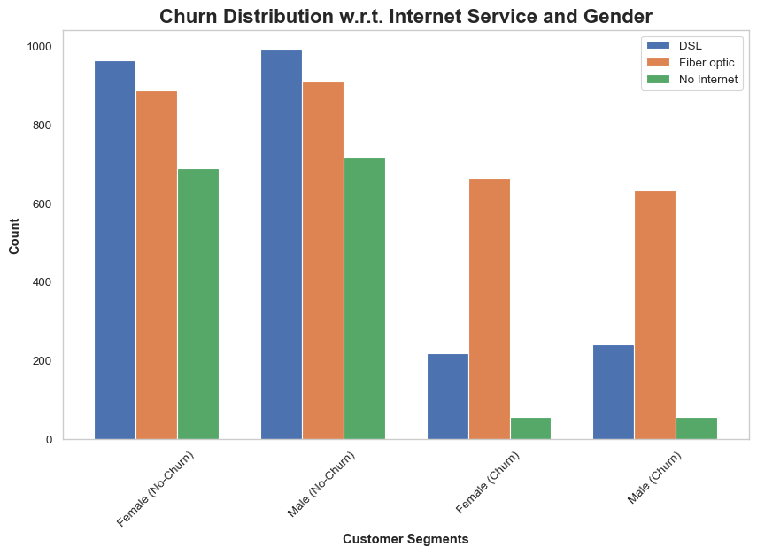

A large number of customers opted for Fiber Optic service; however, this group shows a significantly higher churn rate, suggesting possible dissatisfaction with the service. In contrast, DSL users form the majority and exhibit lower churn rates.

---

**6. Dependent distribution:**

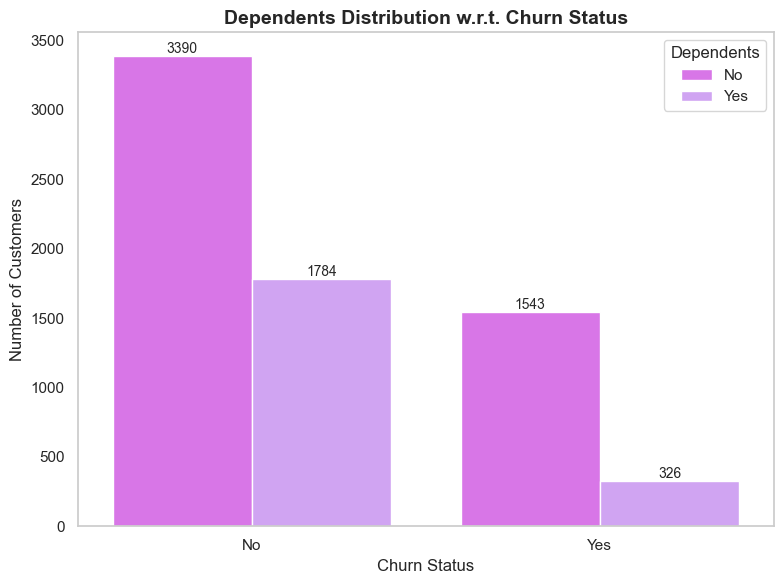

Customers without dependents are more likely to churn

---

**7. Senior Citizen.**

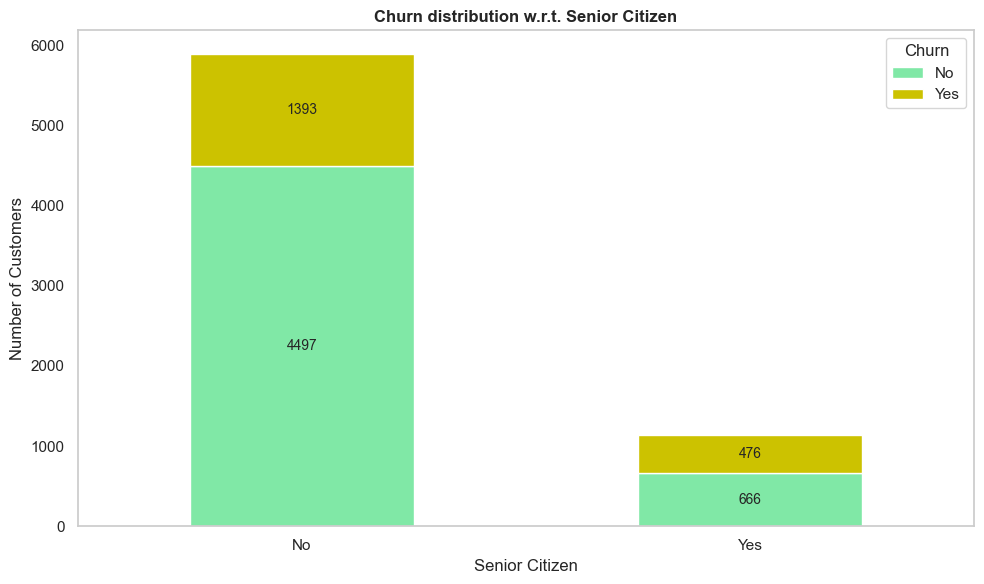

Most of the senior citizens churn; the number of senior citizens are very less in over all customer base.

---

**8. Online Security:**

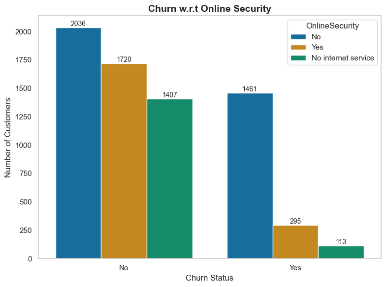

As shown in following graph, most customers churn due to lack of online security.

---

**9. Paperless Billing:**

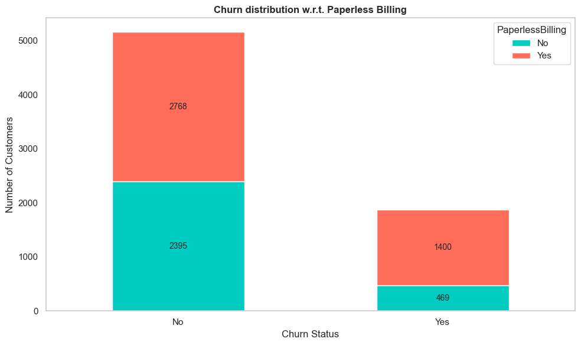

Customers with Paperless Billing are most likely to churn.

---

**10. Tech support:**

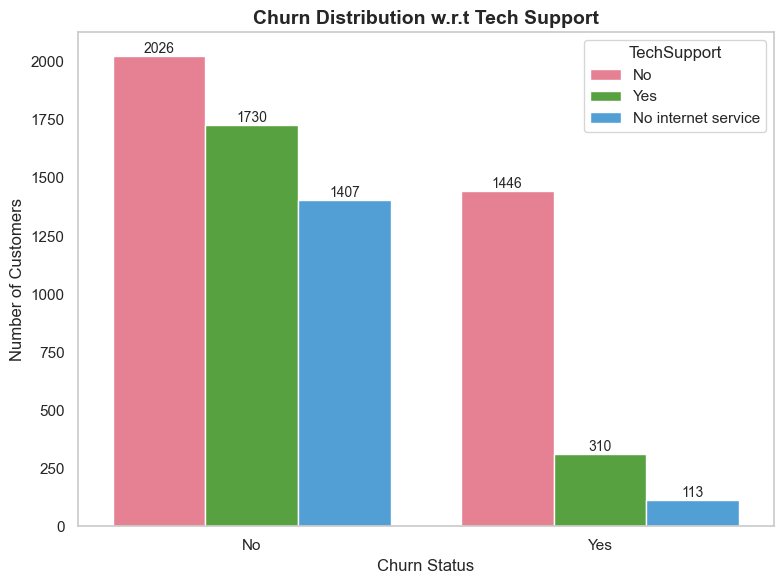

As shown in following chart, customers with no Tech Support are most likely to migrate to another service provider.

---

**11. Distribution w.r.t Charges and Tenure:**

.png)

.png)

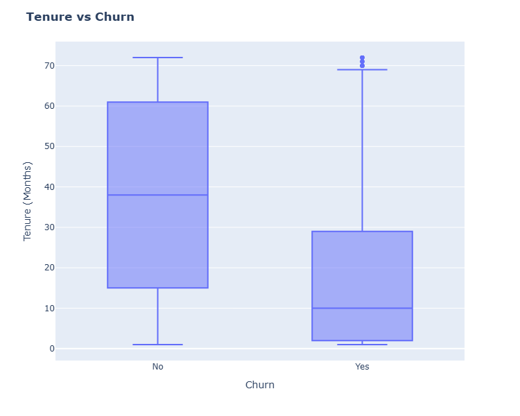

Customers with higher Monthly Charges are also more likely to churn.

New customers are more likely to churn.

